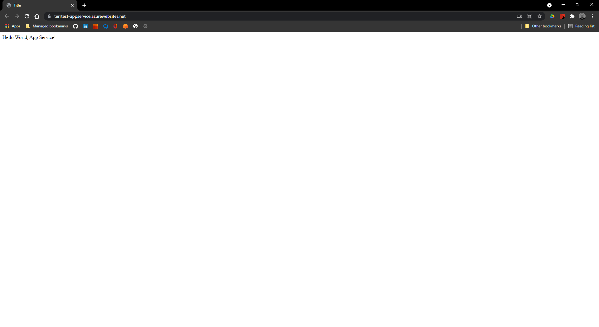

# Azure App Service with Docker - Simple

This example provisions a Linux App Service which runs a single Docker container.

In more detail it performs the following:

1. Provisions an Azure Resource Group to house all resources necessary for application to run.
2. Provisions an Azure App Service Plan to house the app to deploy.
3. Provisions the Azure App itself and runs it using a single Linux Docker Container (Python Base).

## Pre-Requisites

1. `az-cli` must be installed and configured to authenticate with your Azure subscription and tenant.
2. Terraform must be installed on the OS you are running commands from. In my case, I have `az` installed on Windows Host, but `terraform` installed on my WSL Distro.

## Configuration

Three configuration files are used to provision the Azure infrastructure:

- [main.tf](main.tf)
- [variables.tf](variables.tf)
- [output.tf](output.tf)

### main.tf

*Note: this configuration relies on the variable values `prefix` and `location` supplied either via the default values in `variables.tf` or using the command flag `-var` when running the `terraform apply` command.*

```terraform
# Configure the Azure provider
terraform {
  required_providers {
    azurerm = {
      source  = "hashicorp/azurerm"
      version = "~> 2.65"
    }
  }

  required_version = ">= 0.14.9"
}

provider "azurerm" {
  features {}
}

resource "azurerm_resource_group" "main" {
  name     = "${var.prefix}-resources"
  location = "${var.location}"
}

resource "azurerm_app_service_plan" "main" {
  name                = "${var.prefix}-asp"
  location            = "${azurerm_resource_group.main.location}"
  resource_group_name = "${azurerm_resource_group.main.name}"
  kind                = "Linux"
  reserved            = true

  sku {
    tier = "Standard"
    size = "S1"
  }
}

resource "azurerm_app_service" "main" {
  name                = "${var.prefix}-appservice"
  location            = "${azurerm_resource_group.main.location}"
  resource_group_name = "${azurerm_resource_group.main.name}"
  app_service_plan_id = "${azurerm_app_service_plan.main.id}"

  site_config {
    app_command_line = ""
    linux_fx_version = "DOCKER|appsvcsample/python-helloworld:latest"
  }

  app_settings = {
    "WEBSITES_ENABLE_APP_SERVICE_STORAGE" = "false"
    "DOCKER_REGISTRY_SERVER_URL"          = "https://index.docker.io"
  }
}
```

## variables.tf

Configuration file supplying variables utlized in `main.tf` to provision the resources on Azure.

Variables are:
- `prefix`
- `location`

```terraform
variable "prefix" {
  description = "The prefix used for all resources in this example"
  default = "terrtest"
}

variable "location" {
  description = "The Azure location where all resources in this example should be created"
  default = "eastus"
}
```

## outputs.tf

The `outputs.tf` config file tells Terraform what outputs to create, as well as their configured settings on Azure.

Here I am telling Terraform to output an `app_service_plan` with a default hostname. 

```terraform
output "app_service_name" {
  value = "${azurerm_app_service.main.name}"
}

output "app_service_default_hostname" {
  value = "https://${azurerm_app_service.main.default_site_hostname}"
}
```

## Provision the Configured Infrastructure

- Run `terraform init` to initialize configurations
- (Optional) Run `terraform plan` to preview the planned operations or `terraform plan -o=plan.tf` to output the configured plan for later use.
- Run `terraform apply` to apply configurations and provision the infrastructure supplied.

## Verify

Once completed visit the URL or Azure Portal to verify all necessary resources were created and work properly.

Here's my super-fancy deployed Python App:



## Destroy

To destroy all provisioned infrastructure in Azure simply run `terraform destroy`

## Notes

* The Container is launched on the first HTTP Request, which can take a while.
* Continuous Deployment of a single Docker Container can be achieved using the App Setting `DOCKER_ENABLE_CI` to `true`.
* If you're not using App Service Slots and Deployments are handled outside of Terraform - [it's possible to ignore changes to specific fields in the configuration using `ignore_changes` within Terraform's `lifecycle` block](https://www.terraform.io/docs/configuration/resources.html#lifecycle), for example:

```hcl
resource "azurerm_app_service" "test" {
  # ...
  site_config = {
    # ...
    linux_fx_version = "DOCKER|appsvcsample/python-helloworld:0.1.2"
  }

  lifecycle {
    ignore_changes = [
      "site_config.0.linux_fx_version", # deployments are made outside of Terraform
    ]
  }
}
```
